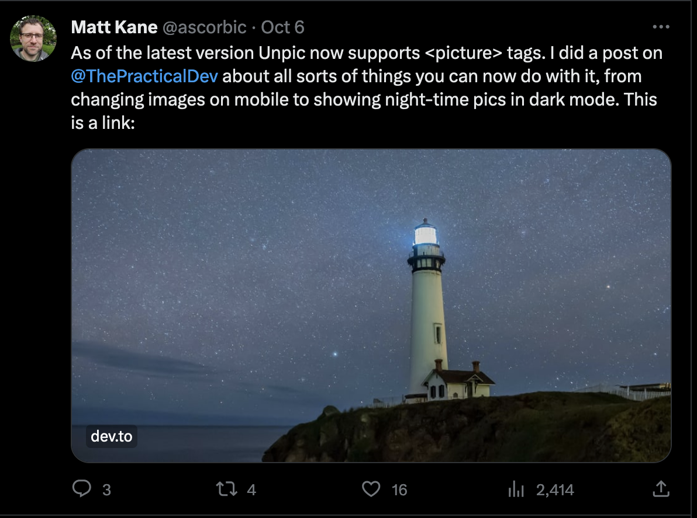

In September 2023, Twitter (sorry, X) changed links to no longer show a preview of the link. They just show an image. This was done to make things look nicer, but makes it hard to see what is a link and what is just an image. You also can't see the title or description anymore. Many people don't want to click links if they don't know what the target is, so this is a problem.

Luckily there is a workaround. This post will show how you can use dynamic Open Graph images to bring back the Twitter link preview, while keeping other social media platforms happy.

## The problem

Look at this tweet with a previous post of mine. It has a lovely photo, but aside from the little domain label there's no indication that it's a link or what the linked page is about.



This is what links used to look like. Now, you may agree that the other one looks nice, but I'm going to guess that this one will get more clicks.


## Dynamic Open Graph images

I am going to use [og_edge](https://unpic.pics/og-edge) to generate dynamic Open Graph images. This is a fork of `@vercel/og` that makes it cross-platform so you can use it with frameworks other than Next.js.

I am going to deploy this to Netlify Edge Functions, and will show it with an Astro site, but the principles are the same for any framework.

`og_edge` uses [Satori](https://github.com/vercel/satori), which lets you use JSX to generate images, and runs in edge functions. This means that the image is generated on the fly, and you can pass in dynamic data to generate the image.

## The code

I'm starting with the default Astro blog template. To create a Netlify edge function, you need to create a file in `netlify/edge-functions` in the root of your site. I'm going to call mine `og.tsx`.

This is the basic code to use og_edge:

```tsx
// Just need something that renders JSX. You can use React, but Preact is fine.
/** @jsxImportSource https://esm.sh/preact */

// You don't need to install this, as it's loaded from the URL
import { ImageResponse } from "https://deno.land/x/og_edge/mod.ts";

export default function handler() {
  return new ImageResponse(<div>Hello world!</div>, {
    width: 960,
    height: 480,
  });
}

export const config = {
  path: "/og/twitter,
};
```

Satori supports basic styling, including flexbox. I want to create a design like the old Twitter link preview.

```tsx
return new ImageResponse(
    (
      <div
        style={{
          color: "black",
          flexDirection: "column",
          justifyContent: "center",
          alignItems: "center",
          display: "flex",
          fontSize: 28,
          width: 960,
          height: 480,
        }}
      >
        <div
          style={{
            width: "100%",
            flex: 1,
            backgroundSize: "cover",
            background: `url(https://images.unsplash.com/photo-1601805825132-5d7bbab226d3?auto=format&fit=crop&w=960&h=380)`,
          }}
        ></div>
        <div
          style={{
            backgroundColor: "white",
            textAlign: "left",
            display: "flex",
            flexDirection: "column",
            width: "100%",
            padding "20px 48px",
          }}
        >
          <p
            style={{
              margin: 0,
            }}
          >
            Bring back the Twitter link preview
          </p>
            <p
              style={{
                marginTop: 10,
                marginBottom: 10,
              }}
            >
              Use dynamic OG images to bring back the Twitter link preview
            </p>

          <p
            style={{
              color: "#666666",
              margin: 0,
              fontSize: 26,
            }}
          >
            mk.gg
          </p>
        </div>
      </div>
    ),
    {
      width: 960,
      height: 480,
    }
  );
}
// This is the URL where the image will be available
export const config = {
  path: "/og.png",
};
```

I want to change the text to have bold headers, which means I need custom fonts. Right now I'm using the default font which is Noto Sans Regular. Satori allows us to load custom fonts, so I'm going to load the weights I need.

```tsx
const notoBold = await loadFont(
  "https://cdn.jsdelivr.net/fontsource/fonts/noto-sans@latest/latin-800-normal.ttf"
);

const notoSans = await loadFont(
  "https://cdn.jsdelivr.net/fontsource/fonts/noto-sans@latest/latin-500-normal.ttf"
);

function loadFont(name: string) {
  return fetch(name).then((res) => res.arrayBuffer());
}
```

I've added a little helper to load the fonts, which just loads the font and returns the array buffer. I can then pass this to the constructor:

```tsx
{
    width: 960,
    height: 480,
    fonts: [
    {
        name: "noto-sans",
        style: "normal",
        data: notoBold,
        weight: 800,
    },
    {
        name: "noto-sans",
        style: "normal",
        data: notoSans,
        weight: 500,
    },
    ],
}
```

Now let's add it all together by adding the styles to the JSX:

```tsx
/** @jsxImportSource https://esm.sh/preact */

import { ImageResponse } from "https://deno.land/x/og_edge/mod.ts";

const notoBold = await loadFont(
  "https://cdn.jsdelivr.net/fontsource/fonts/noto-sans@latest/latin-800-normal.ttf"
);

const notoSans = await loadFont(
  "https://cdn.jsdelivr.net/fontsource/fonts/noto-sans@latest/latin-500-normal.ttf"
);

function loadFont(name: string) {
  return fetch(name).then((res) => res.arrayBuffer());
}

export default function handler(req: Request) {
  return new ImageResponse(
    (
      <div
        style={{
          color: "black",
          flexDirection: "column",
          justifyContent: "center",
          alignItems: "center",
          display: "flex",
          width: 960,
          height: 480,
        }}
      >
        <div
          style={{
            width: "100%",
            flex: 1,
            backgroundSize: "cover",
            background: `url(https://images.unsplash.com/photo-1601805825132-5d7bbab226d3?auto=format&fit=crop&w=960&h=380)`,
          }}
        ></div>
        <div
          style={{
            backgroundColor: "white",
            textAlign: "left",
            display: "flex",
            flexDirection: "column",
            width: "100%",
            fontSize: 28,
            padding "20px 48px",
          }}
        >
          <p
            style={{
              margin: 0,
              fontFamily: "noto-sans",
              fontWeight: 800,
            }}
          >
            Bring back the Twitter link preview
          </p>
          <p
            style={{
              fontSize: 28,
              marginTop: 10,
              marginBottom: 10,
            }}
          >
            Use dynamic OG images to bring back the Twitter link preview
          </p>
          <p
            style={{
              color: "#666666",
              margin: 0,
              fontSize: 26,
            }}
          >
            mk.gg
          </p>
        </div>
      </div>
    ),
    {
      width: 960,
      height: 480,
      fonts: [
        {
          name: "noto-sans",
          style: "normal",
          data: notoBold,
          weight: 800,
        },
        {
          name: "noto-sans",
          style: "normal",
          data: notoSans,
          weight: 500,
        },
      ],
    }
  );
}

export const config = {
  path: "/og/twitter",
};
```

Now this is all well and good, but you don't want to manually create this for every page. Now we can make it dynamic. I'm going to get the title, description and image URL from the query string.

```tsx
// Just need something that renders JSX. React works too.
/** @jsxImportSource https://esm.sh/preact */

import { ImageResponse } from "https://deno.land/x/og_edge/mod.ts";

const notoBold = await loadFont(
  "https://cdn.jsdelivr.net/fontsource/fonts/noto-sans@latest/latin-800-normal.ttf"
);

const notoSans = await loadFont(
  "https://cdn.jsdelivr.net/fontsource/fonts/noto-sans@latest/latin-500-normal.ttf"
);

function loadFont(name: string) {
  return fetch(name).then((res) => res.arrayBuffer());
}

// I've hard coded the domain here, but you could get it from the request
const domain = "mk.gg";

export default function handler(req: Request) {
  const url = new URL(req.url);

  const title = url.searchParams.get("title");
  const description = url.searchParams.get("description");
  const image = url.searchParams.get("image");

  let imageUrl;
  try {
    // Try to parse the image URL. Fail if it's not a valid URL.
    imageUrl = new URL(image);
  } catch (e) {}

  return new ImageResponse(
    (
      <div
        style={{
          color: "black",
          flexDirection: "column",
          justifyContent: "center",
          alignItems: "center",
          display: "flex",
          width: 960,
          height: 480,
        }}
      >
        <div
          style={{
            width: "100%",
            flex: 1,
            backgroundSize: "cover",
            // If there's no image, use a background color
            background: image ? `url(${imageUrl.toString()})` : "#000033",
          }}
        ></div>
        <div
          style={{
            backgroundColor: "white",
            textAlign: "left",
            display: "flex",
            flexDirection: "column",
            width: "100%",
            fontSize: 28,
            padding "20px 48px",
          }}
        >
          <p
            style={{
              margin: 0,
              fontFamily: "noto-sans",
              fontWeight: 800,
            }}
          >
            {title}
          </p>
          {description ? (
            <p
              style={{
                fontSize: 28,
                marginTop: 10,
                marginBottom: 10,
              }}
            >
              {description}
            </p>
          ) : null}
          <p
            style={{
              color: "#666666",
              margin: 0,
              fontSize: 26,
            }}
          >
            {domain}
          </p>
        </div>
      </div>
    ),
    {
      width: 960,
      height: 480,
      fonts: [
        {
          name: "noto-sans",
          style: "normal",
          data: notoBold,
          weight: 800,
        },
        {
          name: "noto-sans",
          style: "normal",
          data: notoSans,
          weight: 500,
        },
      ],
    }
  );
}

export const config = {
  path: "/og/twitter",
};
```

Now we have a dynamic image that we can use for any page. We can dynamically generate it by passing in the title, description and image URL as query parameters in the URL. I'm going to show how to do this with Astro, but most frameworks will have somethign similar. If the page has no description then that line is hidden, and if not image is provided then we use a background color.

I'm using the default Astro blog starter template which already allows you to set the title, description and OG image. We just need to change them a bit to use our edge function. Here's the original version in `src/components/BaseHead.astro`:

```astro
---

// Snip

const { title, description, image = '/blog-placeholder-1.jpg' } = Astro.props;
---
<!-- Snip -->
<!-- Open Graph / Facebook -->
<meta property="og:type" content="website" />
<meta property="og:url" content={Astro.url} />
<meta property="og:title" content={title} />
<meta property="og:description" content={description} />
<meta property="og:image" content={new URL(image, Astro.url)} />

<!-- Twitter -->
<meta property="twitter:card" content="summary_large_image" />
<meta property="twitter:url" content={Astro.url} />
<meta property="twitter:title" content={title} />
<meta property="twitter:description" content={description} />
<meta property="twitter:image" content={new URL(image, Astro.url)} />
```

If we just change the Twitter image then we can let other sites such as Facebook use the regular image, while Twitter gets the version with the embedded title and description.

```astro
---

// Snip

const { title, description, image = '/blog-placeholder-1.jpg' } = Astro.props;

// This is the path set in the edge function config
const og = new URL("/og/twitter", Astro.url);

og.searchParams.set("title", title);
og.searchParams.set("description", description);
og.searchParams.set("image", new URL(image, Astro.url).toString());

---
<!-- Snip -->
<!-- Open Graph / Facebook -->
<meta property="og:type" content="website" />
<meta property="og:url" content={Astro.url} />
<meta property="og:title" content={title} />
<meta property="og:description" content={description} />
<meta property="og:image" content={new URL(image, Astro.url)} />

<!-- Twitter -->
<meta property="twitter:card" content="summary_large_image" />
<meta property="twitter:url" content={Astro.url} />
<meta property="twitter:title" content={title} />
<meta property="twitter:description" content={description} />
<meta property="twitter:image" content={og.toString()} />
```

This will generate a dynamic image for Twitter, but use the regular image for other sites. Now we can see the title and description again.


You can of course customise the way the image is displayed, and if Twitter ever starts allowing links again then you can just remove the edge function and use the regular image.
